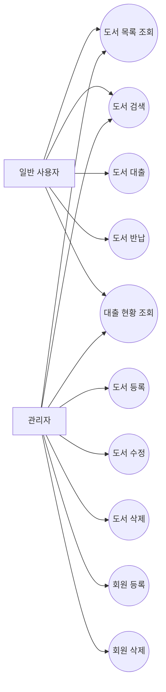
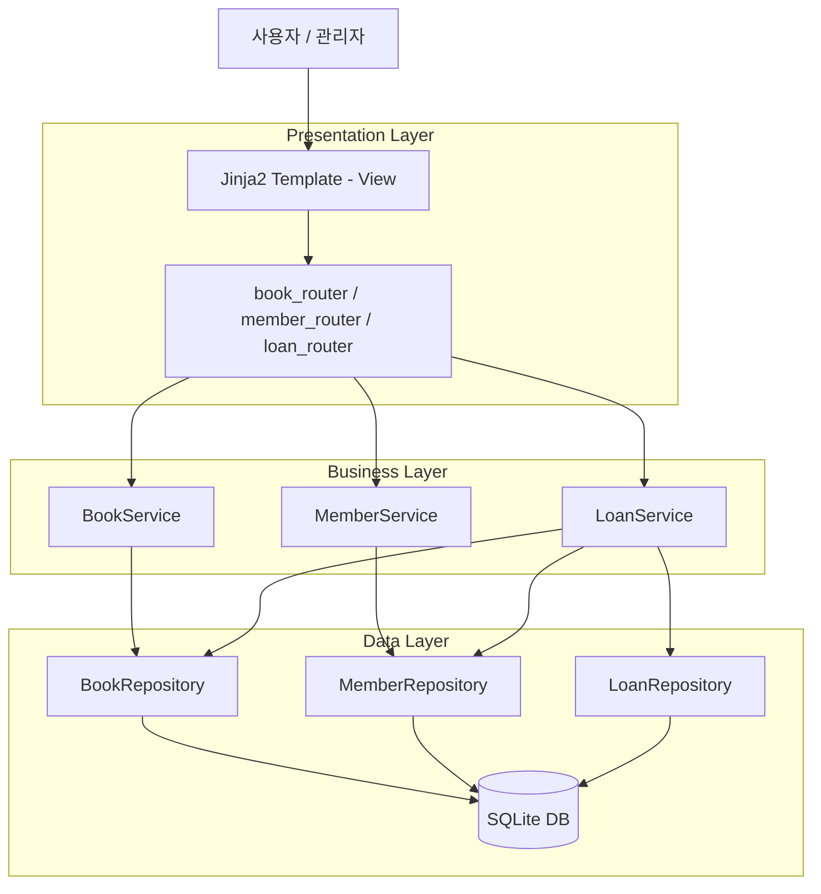
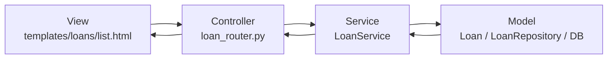
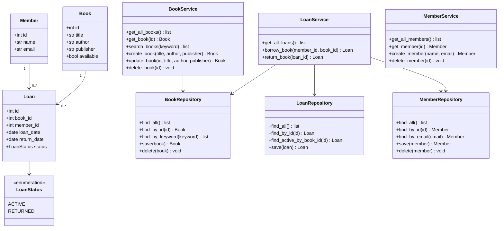
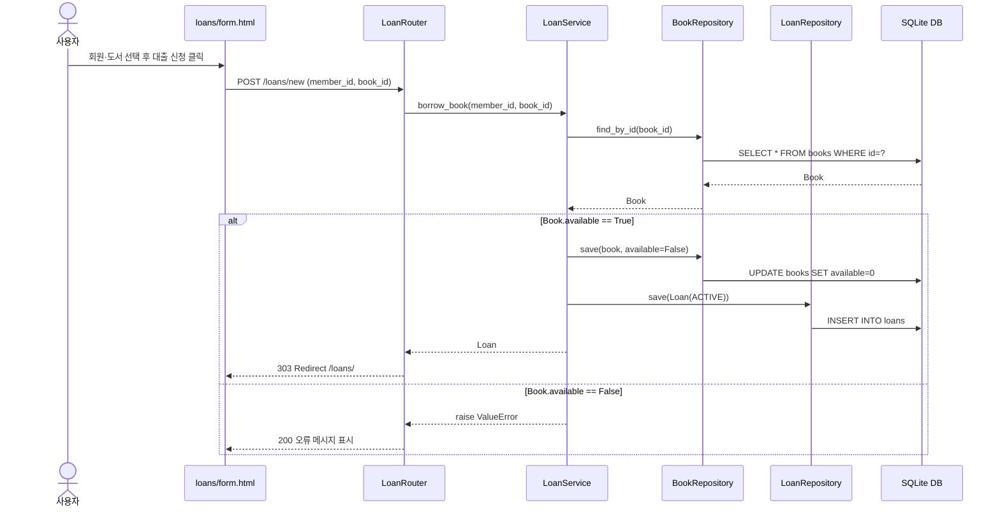
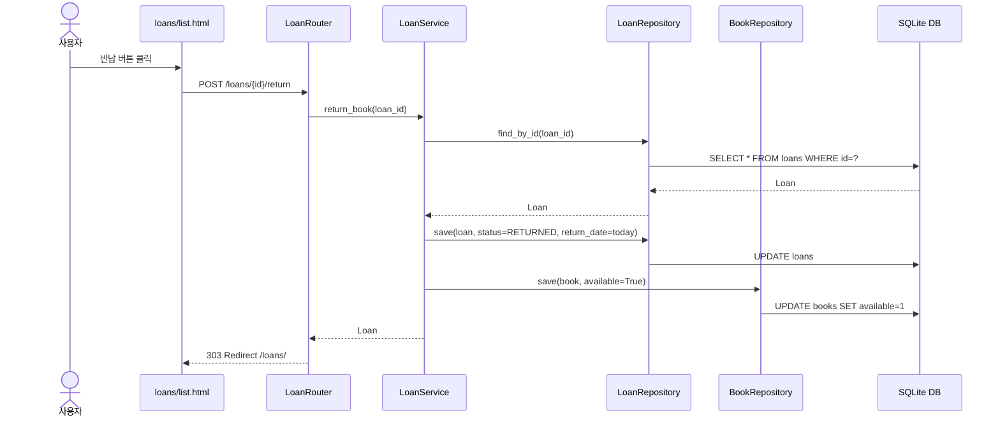
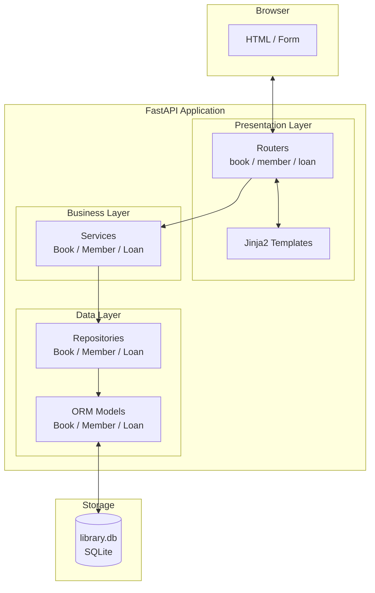

# 도서 대출 관리 시스템 명세서

---

## 1. 프로젝트 개요

### 1.1 주제 선정 배경

도서관에서 도서 대출·반납 업무를 수작업으로 처리할 경우 대출 가능 여부 확인, 연체 추적, 도서 현황 파악에 오류가 발생하기 쉽다. 이를 해결하기 위해 회원–도서–대출 관계를 명확히 모델링하고, 웹 기반으로 관리할 수 있는 시스템을 개발한다.

### 1.2 개발 목표

- 도서 등록·검색·수정·삭제 기능 제공
- 회원 등록 및 관리 기능 제공
- 도서 대출 가능 여부를 시스템이 자동 판단하여 대출·반납 처리
- 3 Layer Architecture와 MVC 패턴을 적용하여 유지보수성 확보

### 1.3 5W1H 분석

| 항목 | 내용 |
|------|------|
| **Why** | 도서 대출 현황을 체계적으로 관리하고 오류를 줄이기 위해 |
| **Who** | 도서를 대출·반납하는 일반 사용자, 도서·회원을 관리하는 관리자 |
| **When** | 도서 대출·반납이 발생하는 시점, 도서·회원 정보 변경이 필요한 시점 |
| **Where** | 웹 브라우저 기반의 로컬 웹 애플리케이션 |
| **What** | 도서 CRUD, 회원 CRUD, 대출 및 반납, 대출 현황 조회 |
| **How** | FastAPI + Jinja2 + SQLite, 3 Layer + MVC 아키텍처 |

---

## 2. 요구사항 분석

### 2.1 기능 요구사항

| ID | 요구사항 |
|----|---------|
| FR-01 | 사용자는 전체 도서 목록을 조회할 수 있다. |
| FR-02 | 사용자는 제목 또는 저자 키워드로 도서를 검색할 수 있다. |
| FR-03 | 관리자는 도서를 등록할 수 있다. (제목, 저자, 출판사) |
| FR-04 | 관리자는 도서 정보를 수정할 수 있다. |
| FR-05 | 관리자는 도서를 삭제할 수 있다. 단, 대출 중인 도서는 삭제할 수 없다. |
| FR-06 | 관리자는 회원을 등록할 수 있다. (이름, 이메일) |
| FR-07 | 관리자는 회원을 삭제할 수 있다. |
| FR-08 | 사용자는 대출 가능한 도서를 대출할 수 있다. |
| FR-09 | 시스템은 대출 시 도서 상태를 '대출 중'으로 변경한다. |
| FR-10 | 사용자는 대출 중인 도서를 반납할 수 있다. |
| FR-11 | 시스템은 반납 시 도서 상태를 '대출 가능'으로 변경하고 반납일을 기록한다. |
| FR-12 | 사용자는 전체 대출 현황(도서명, 회원명, 대출일, 반납일, 상태)을 조회할 수 있다. |

### 2.2 비기능 요구사항

| ID | 요구사항 |
|----|---------|
| NFR-01 | 사용자는 3회 이하의 클릭으로 도서 검색 결과에 접근할 수 있어야 한다. |
| NFR-02 | 잘못된 입력(중복 이메일, 이미 대출 중인 도서)에 대해 오류 메시지를 화면에 표시해야 한다. |
| NFR-03 | 도서·회원 삭제 전 브라우저 재확인 절차를 제공해야 한다. |
| NFR-04 | Presentation / Business / Data 계층을 코드 수준에서 분리하여 유지보수가 가능해야 한다. |
| NFR-05 | 데이터는 SQLite DB에 저장되어 서버 재시작 후에도 유지되어야 한다. |

---

## 3. Use-case 목록 및 다이어그램

### 3.1 Actor 정의

| Actor | 설명 |
|-------|------|
| 일반 사용자 | 도서 조회, 검색, 대출, 반납, 대출 현황 조회 수행 |
| 관리자 | 도서 등록·수정·삭제, 회원 등록·삭제 수행 |

### 3.2 Use-case 다이어그램

---

## 4. 시나리오

### 4.1 시나리오: 도서 대출

| 항목 | 내용 |
|------|------|
| Use-case | 도서 대출 (UC-03) |
| Actor | 일반 사용자 |
| 사전 조건 | 사용자는 등록된 회원이며, 대출하려는 도서는 '대출 가능' 상태이다. |
| 기본 흐름 | 1. 사용자가 대출 화면으로 이동한다.  2. 시스템이 대출 가능한 도서 목록과 회원 목록을 표시한다.  3. 사용자가 회원과 도서를 선택하고 대출 신청 버튼을 클릭한다.  4. 시스템이 도서 대출 가능 여부를 확인한다.  5. 시스템이 Loan 레코드를 생성하고 도서 상태를 '대출 중'으로 변경한다.  6. 시스템이 대출 현황 화면으로 이동한다. |
| 예외 흐름 | 4a. 이미 대출 중인 도서라면 오류 메시지("대출 중입니다")를 표시하고 폼을 재표시한다. |
| 사후 조건 | Loan 레코드가 생성되고 Book.available = False로 변경된다. |

### 4.2 시나리오: 도서 반납

| 항목 | 내용 |
|------|------|
| Use-case | 도서 반납 (UC-04) |
| Actor | 일반 사용자 |
| 사전 조건 | 해당 대출 기록의 상태가 ACTIVE이다. |
| 기본 흐름 | 1. 사용자가 대출 현황 화면에서 반납 버튼을 클릭한다.  2. 브라우저가 반납 의사를 재확인한다.  3. 시스템이 Loan.status를 RETURNED로 변경하고 반납일을 기록한다.  4. 시스템이 Book.available = True로 복구한다.  5. 시스템이 대출 현황 화면을 새로 표시한다. |
| 예외 흐름 | 3a. 이미 반납된 기록이라면 오류 메시지를 표시한다. |
| 사후 조건 | Loan.status = RETURNED, Loan.return_date 기록됨, Book.available = True |

### 4.3 시나리오: 도서 삭제

| 항목 | 내용 |
|------|------|
| Use-case | 도서 삭제 (UC-08) |
| Actor | 관리자 |
| 사전 조건 | 해당 도서가 DB에 존재한다. |
| 기본 흐름 | 1. 관리자가 도서 목록에서 삭제 버튼을 클릭한다.  2. 브라우저가 삭제 의사를 재확인한다.  3. 시스템이 Book.available 여부를 확인한다.  4. 시스템이 도서 레코드를 삭제한다. |
| 예외 흐름 | 3a. Book.available = False(대출 중)이라면 "대출 중인 도서는 삭제할 수 없습니다" 오류 메시지를 표시한다. |
| 사후 조건 | 도서 레코드가 DB에서 제거된다. |

---

## 5. 시스템 설계

### 5.1 3 Layer Architecture

### 5.2 MVC 패턴

| MVC 요소 | 본 프로젝트 적용 |
|----------|----------------|
| Model | `models/` (Book, Member, Loan), `repositories/`, SQLite DB |
| View | `templates/` (Jinja2 HTML) |
| Controller | `routers/` (FastAPI APIRouter) |

### 5.3 Class Diagram

### 5.4 Sequence Diagram — 도서 대출

### 5.5 Sequence Diagram — 도서 반납

### 5.6 Component Diagram

---

## 6. 데이터베이스 설계

### 테이블 정의

**books**

| 컬럼 | 타입 | 제약 |
|------|------|------|
| id | INTEGER | PK, AUTO INCREMENT |
| title | VARCHAR | NOT NULL |
| author | VARCHAR | NOT NULL |
| publisher | VARCHAR | NOT NULL |
| available | BOOLEAN | NOT NULL, DEFAULT 1 |

**members**

| 컬럼 | 타입 | 제약 |
|------|------|------|
| id | INTEGER | PK, AUTO INCREMENT |
| name | VARCHAR | NOT NULL |
| email | VARCHAR | NOT NULL, UNIQUE |

**loans**

| 컬럼 | 타입 | 제약 |
|------|------|------|
| id | INTEGER | PK, AUTO INCREMENT |
| book_id | INTEGER | FK → books.id, NOT NULL |
| member_id | INTEGER | FK → members.id, NOT NULL |
| loan_date | DATE | NOT NULL |
| return_date | DATE | NULL 허용 |
| status | ENUM | NOT NULL, DEFAULT 'ACTIVE' |

---

## 7. 설계 원칙 적용 결과

| 원칙 | 적용 내용 |
|------|----------|
| 모듈화 (분할과 정복) | 기능을 Model / Repository / Service / Router 4계층으로 분리 |
| 캡슐화 | Service가 Repository를 내부에 보유하고 외부에 노출하지 않음 |
| 정보 은닉 | Router는 Service 인터페이스만 호출하고 DB 접근 방법을 알지 못함 |
| 높은 응집도 | BookService는 도서 관련 로직만, LoanService는 대출 로직만 담당 |
| 낮은 결합도 | 각 계층은 인접 계층에만 의존하며 계층을 건너뛰는 호출 없음 |
| SRP (단일 책임) | 하나의 클래스는 하나의 책임만 가짐 (예: BookRepository는 DB 접근만) |
