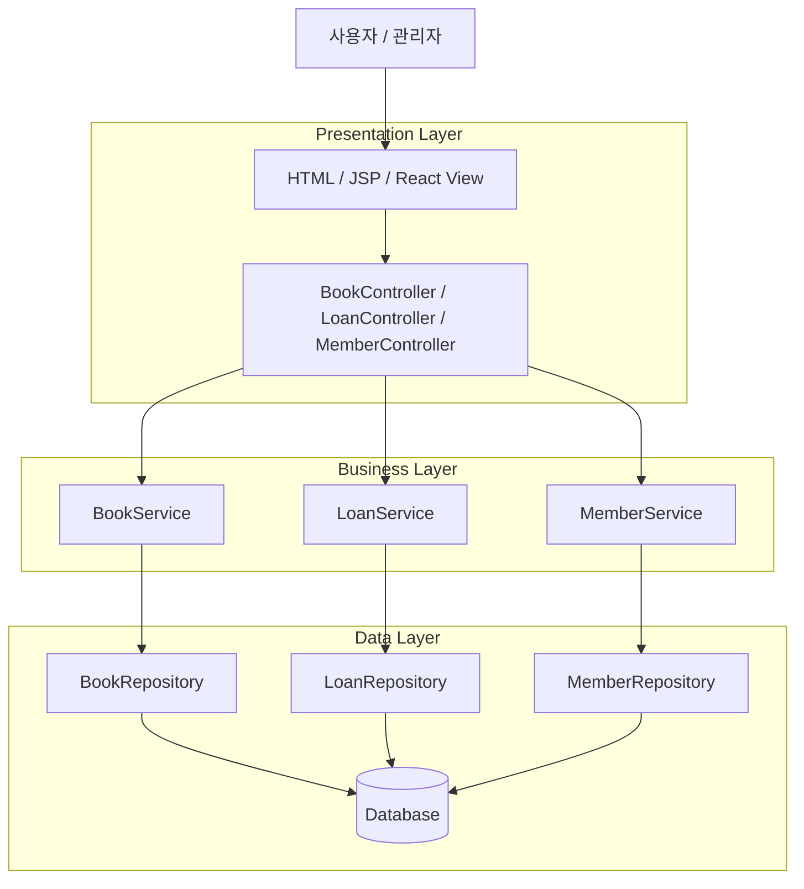
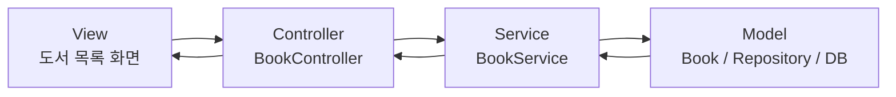
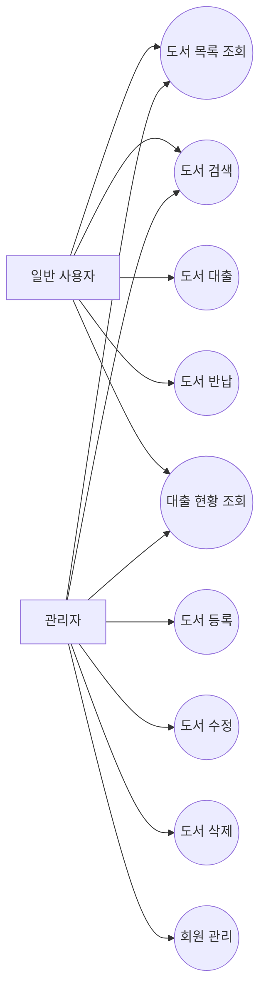
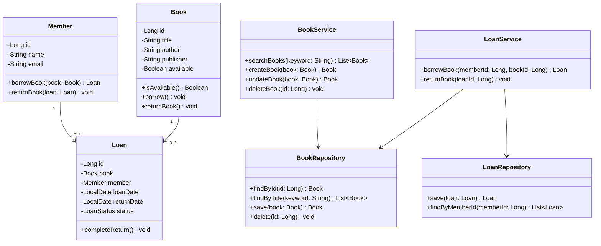
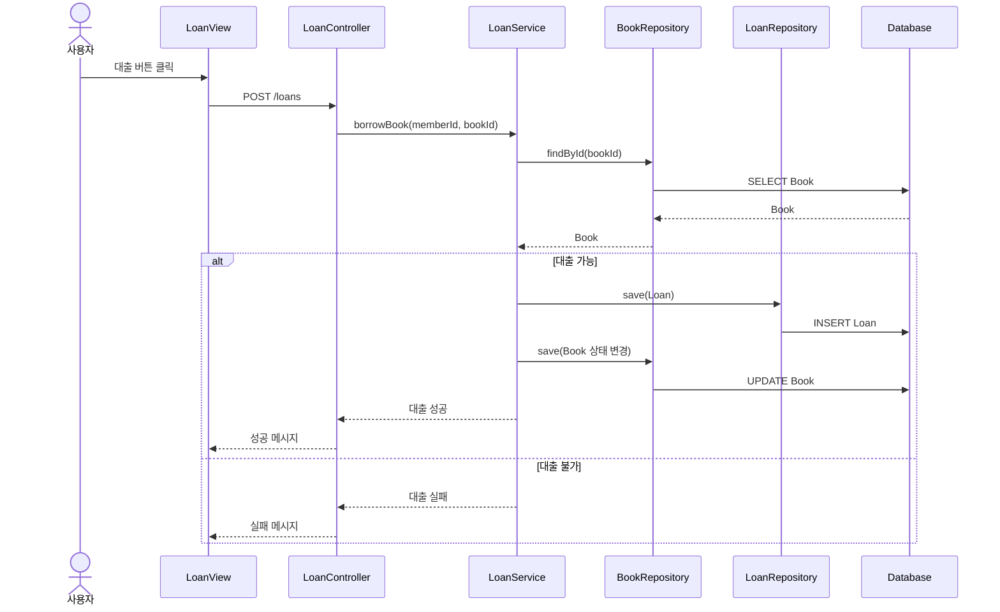

## 결론: **“소규모 도서 대출 관리 웹앱”**이 가장 적합함

이번 소프트웨어 공학 프로젝트는 **구현 난이도보다 설계 산출물의 완성도**가 중요해 보입니다. 따라서 주제는 너무 독창적이기보다, **요구사항–유즈케이스–시나리오–클래스–컴포넌트–시퀀스–MVC/3 Layer 구현**이 자연스럽게 연결되는 것이 좋습니다.

강의 자료에서도 요구사항은 기능·비기능 요구를 명확히 하고, 5W1H로 문서화하는 방향을 제시하고 있습니다.  또한 아키텍처 설계에서는 4+1 관점, Use-case Diagram, Class Diagram, Sequence Diagram, Component Diagram 등을 다루고 있으며, 계층 스타일과 MVC 스타일이 주요 설계 대상으로 제시됩니다. 

따라서 추천 주제는 다음입니다.

# 1순위 추천 주제

## **도서 대출 관리 시스템**

### 한 줄 정의

> 사용자가 도서를 검색하고 대출·반납하며, 관리자는 도서와 회원 정보를 관리하는 소규모 웹 기반 CRUD 시스템

---

## 왜 이 주제가 좋은가?

| 평가 기준             |   적합도 | 이유                                               |
| ----------------- | ----: | ------------------------------------------------ |
| 요구사항 작성           | 매우 좋음 | 회원, 도서, 대출, 반납이라는 명확한 기능 단위가 있음                  |
| Use-case Diagram  | 매우 좋음 | 사용자/관리자 Actor 분리가 쉬움                             |
| 시나리오 작성           | 매우 좋음 | “도서 검색 → 대출 신청 → 반납” 흐름이 명확함                     |
| Class Diagram     | 매우 좋음 | Book, Member, Loan, Admin 등 객체 도출이 쉬움            |
| Sequence Diagram  | 매우 좋음 | Controller-Service-Repository 흐름 표현이 쉬움          |
| Component Diagram |    좋음 | View, Controller, Service, Repository, DB로 분리 가능 |
| 3 Layer 적용        | 매우 좋음 | Presentation / Business / Data 계층이 자연스러움         |
| MVC 적용            | 매우 좋음 | View-Controller-Model 분리가 명확함                    |
| 구현 난이도            | 낮음~중간 | CRUD 중심이라 안정적으로 구현 가능                            |
| 보고서 분량 확보         | 매우 좋음 | 기능은 단순하지만 설계 설명거리가 충분함                           |

---

# 최종 선정안

## 프로젝트명

> **도서 대출 관리 웹 애플리케이션**

## 핵심 기능

| 구분     | 기능                                      |
| ------ | --------------------------------------- |
| 회원 기능  | 회원 등록, 회원 조회, 회원 수정, 회원 삭제              |
| 도서 기능  | 도서 등록, 도서 목록 조회, 도서 검색, 도서 정보 수정, 도서 삭제 |
| 대출 기능  | 도서 대출, 대출 목록 조회, 대출 가능 여부 확인            |
| 반납 기능  | 도서 반납, 반납일 기록                           |
| 관리자 기능 | 전체 도서/회원/대출 현황 관리                       |

---

# 적용할 수 있는 소프트웨어 공학 요소

## 1. 요구사항 분석

요구사항 자료 기준으로, 이 프로젝트는 **기능 요구사항**과 **비기능 요구사항**을 나누기 쉽습니다. 

### 기능 요구사항 예시

| ID    | 요구사항                            |
| ----- | ------------------------------- |
| FR-01 | 사용자는 도서 목록을 조회할 수 있다.           |
| FR-02 | 사용자는 도서 제목 또는 저자로 도서를 검색할 수 있다. |
| FR-03 | 관리자는 도서를 등록, 수정, 삭제할 수 있다.      |
| FR-04 | 회원은 대출 가능한 도서를 대출할 수 있다.        |
| FR-05 | 회원은 대출 중인 도서를 반납할 수 있다.         |
| FR-06 | 시스템은 도서의 대출 가능 상태를 관리한다.        |

### 비기능 요구사항 예시

| ID     | 요구사항                                     |
| ------ | ---------------------------------------- |
| NFR-01 | 사용자는 3회 이하의 클릭으로 도서 검색 결과에 접근할 수 있어야 한다. |
| NFR-02 | 잘못된 입력에 대해 오류 메시지를 제공해야 한다.              |
| NFR-03 | 도서 삭제 전 확인 절차를 제공해야 한다.                  |
| NFR-04 | 계층 구조를 분리하여 유지보수가 가능해야 한다.               |
| NFR-05 | 데이터는 DB에 저장되어 재시작 후에도 유지되어야 한다.          |

---

## 2. 3 Layer Architecture 적용

강의 자료의 계층 스타일은 기능을 **프레젠테이션 계층, 비즈니스 로직 계층, 데이터 계층**으로 분리한다고 설명합니다. 



---

## 3. MVC 패턴 적용

MVC 스타일은 View, Controller, Model을 분리하여 유지보수성과 확장성을 높이는 구조로 정리되어 있습니다. 

| MVC 요소     | 본 프로젝트 적용                                        |
| ---------- | ------------------------------------------------ |
| Model      | Book, Member, Loan, Repository, DB               |
| View       | 도서 목록 화면, 대출 화면, 관리자 화면                          |
| Controller | BookController, LoanController, MemberController |



---

# 주요 Actor와 Use-case

## Actor

| Actor  | 설명                           |
| ------ | ---------------------------- |
| 일반 사용자 | 도서 조회, 검색, 대출, 반납을 수행        |
| 관리자    | 도서 등록/수정/삭제, 회원 관리, 대출 현황 관리 |

## Use-case Diagram



---

# 주요 시나리오 예시

## 시나리오: 도서 대출

| 항목       | 내용                                                                                                                                                    |
| -------- | ----------------------------------------------------------------------------------------------------------------------------------------------------- |
| Use-case | 도서 대출                                                                                                                                                 |
| Actor    | 일반 사용자                                                                                                                                                |
| 사전 조건    | 사용자는 등록된 회원이며, 도서는 대출 가능 상태이다.                                                                                                                        |
| 기본 흐름    | 1. 사용자가 도서를 검색한다.<br>2. 시스템이 도서 목록을 표시한다.<br>3. 사용자가 대출 버튼을 클릭한다.<br>4. 시스템이 대출 가능 여부를 확인한다.<br>5. 시스템이 대출 정보를 저장한다.<br>6. 시스템이 도서 상태를 “대출 중”으로 변경한다. |
| 예외 흐름    | 이미 대출 중인 도서라면 대출 실패 메시지를 표시한다.                                                                                                                        |
| 사후 조건    | Loan 데이터가 생성되고 Book 상태가 변경된다.                                                                                                                         |

---

# Class Diagram 초안



---

# Sequence Diagram 초안

## 도서 대출 시퀀스



---

# 구현 범위 제안

## 최소 구현 범위, MVP

| 우선순위 | 기능       |
| ---: | -------- |
|    1 | 도서 등록    |
|    2 | 도서 목록 조회 |
|    3 | 도서 검색    |
|    4 | 회원 등록    |
|    5 | 도서 대출    |
|    6 | 도서 반납    |
|    7 | 대출 목록 조회 |

이 정도만 구현해도 **CRUD + 상태 변경 + 비즈니스 로직 + DB 연동 + MVC/3 Layer 구조**가 모두 나옵니다.

---

# 다른 후보와 비교

| 후보           | 장점                                     | 단점                            |       추천도 |
| ------------ | -------------------------------------- | ----------------------------- | --------: |
| 계산기          | 구현 매우 쉬움, 클래스 분리 쉬움                    | DB, CRUD, 유즈케이스, 시나리오가 빈약함    |     ★★☆☆☆ |
| TODO List    | 구현 쉬움, CRUD 명확                         | 너무 흔하고 설계 깊이가 부족할 수 있음        |     ★★★☆☆ |
| 게시판          | CRUD, MVC, DB 구조 좋음                    | 로그인/댓글/권한 넣으면 범위가 커짐          |     ★★★★☆ |
| 키오스크         | 시나리오와 UI가 좋음                           | 주문, 결제, 메뉴, 재고까지 가면 복잡해짐      |     ★★★★☆ |
| **도서 대출 관리** | CRUD, 상태 변경, Actor, 시나리오, UML 모두 균형 좋음 | 너무 크게 잡으면 예약/연체/벌금까지 확장될 수 있음 | **★★★★★** |

---

# 최종 추천 범위

## 주제

> **도서 대출 관리 시스템**

## 구현 방식

> 웹 애플리케이션 기반 MVC + 3 Layer Architecture

## 기술 스택 예시

| 계층           | 기술 예시                                          |
| ------------ | ---------------------------------------------- |
| Presentation | HTML/CSS/JS, JSP, Thymeleaf, React 중 택 1       |
| Controller   | Spring Boot Controller 또는 Flask/FastAPI Router |
| Business     | Service 클래스                                    |
| Data         | Repository / DAO                               |
| DB           | MySQL, H2, SQLite 중 택 1                        |

가장 보고서 작성이 편한 조합은 다음입니다.

> **Spring Boot + Thymeleaf + H2/MySQL**

또는 구현 부담을 낮추려면:

> **Flask/FastAPI + HTML Template + SQLite**

---

# 보고서 목차까지 고려한 구성

```markdown
# 도서 대출 관리 시스템

## 1. 프로젝트 개요
- 주제 선정 배경
- 문제 정의
- 개발 목표

## 2. 요구사항 분석
- 기능 요구사항
- 비기능 요구사항
- 5W1H 분석
- Use-case 목록

## 3. 시스템 설계
- 3 Layer Architecture
- MVC Pattern
- Class Diagram
- Sequence Diagram
- Component Diagram

## 4. 구현
- 프로젝트 구조
- 주요 클래스 설명
- 주요 기능 구현
- DB 설계

## 5. 테스트
- 도서 등록 테스트
- 도서 검색 테스트
- 대출 테스트
- 반납 테스트
- 예외 상황 테스트

## 6. 결론
- 설계 원칙 적용 결과
- 한계점
- 개선 방향
```

---

## 최종 판단

**도서 대출 관리 시스템**이 가장 안정적입니다.

계산기는 구현은 쉽지만 소프트웨어 공학 산출물이 빈약하고, 게시판은 흔하지만 권한·댓글·파일 업로드까지 가면 범위가 커질 수 있습니다. 반면 도서 대출 관리는 기능이 단순하면서도 **회원–도서–대출**이라는 객체 관계가 명확하고, **상태 변경**, **CRUD**, **MVC**, **3 Layer**, **Use-case**, **Sequence Diagram**, **Class Diagram**을 모두 자연스럽게 만들 수 있습니다.
