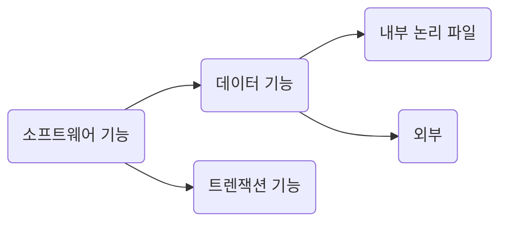
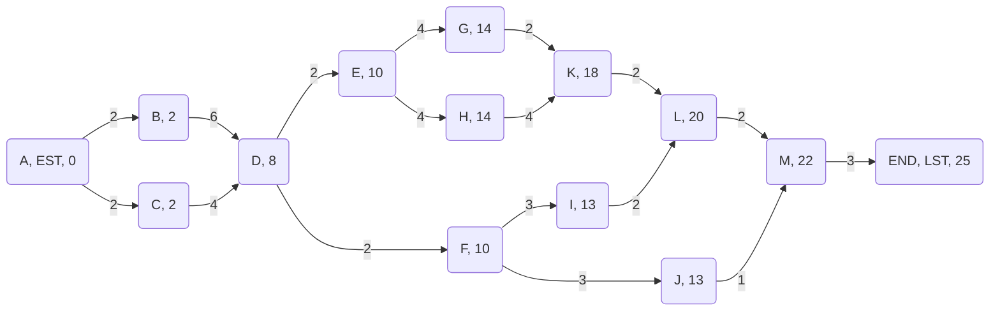
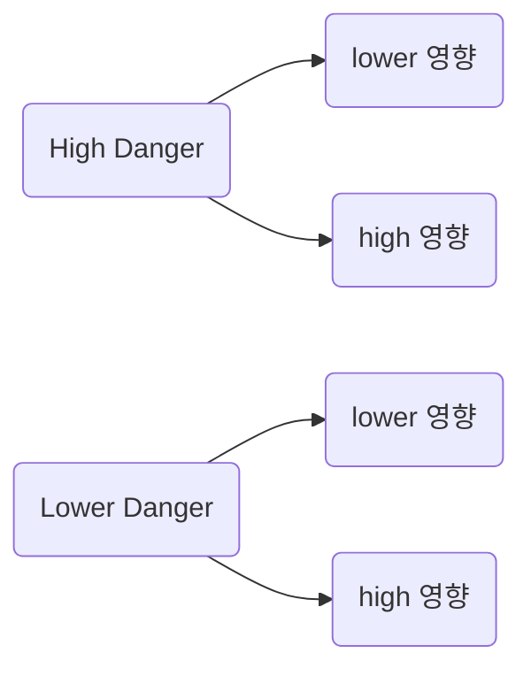

```table-of-contents
```

# 이해
1. 문제 정의
	1. 배경 지식 -> 파악 
2. 타당성 분석
	1. 경제적 타당성
		1. 시장성
		2. 투자 효율성
	2. 기술적 타당성
		1. 개발자의 역량 확보
	3. 법적 타당성
		1. 법적 분쟁

---

# 비용 산정 방법
## 개발 비용에 영향을 주는 요소
1. 프로그래머 자질
2. 소프트웨어 복잡도
3. 소프트웨어 크기
4. 가용시간
5. 신뢰도 수준
6. 기술 수준

> [! note]  브룩스의 법칙 - 과학자
> 어플리케이션 x 3 = 유틸리티
> 유틸리티 x 3 = 시스템 프로그램

## 산정 방법
1. 하향식 산정 기법 - Top-down
	1. 전문가 판단 기법
		1. 조직 내 경험이 있는 2명 이상의 전문가에 비용 산정 의뢰
	2. 델파이 기법
		1. 한 명의 **조정자가** 다수 전문가의 의견을 종합하 비용 산정
		2. 전문가의 산정 에러를 보완
2. 상향식 산정 기법 - Bottom-up
	1. 세부 작업 단위별로 비용을 산정한 후, 이들을 합산하전체 개발 비용을 계산하는 방법
	2. LoC - Line of Code / 원시 코드 라인 수 기법
		1. 가중치
			1. 비관치
			2. 중간치
				1. 가중치 4
			3. 낙관치
			4. 총 합 6
		2. 구현에 치중된 산정 방식
	3. 개발 단계별 노력 기법
		1. 소프트웨어 개발 생명주기의 각 단계에 따라 필요한 노력을 나누어 계산한다
		2. LoC보다 단계 별 파악을 수행하여, 더 정확한 산정이 가능, LoC의 보완
3. COCOMO - 수학적 산정 기법 / 보엠*
	1. Constructive Cost Model
	2. MM 예측
	3. 유형
		1. 단순형 프로젝트
		2. 중간형 프로젝트
		3. 내장형 프로젝트
	4. 산정 방법
		1. $$PM=a*(KDSI)^b*EAF$$
		2. PM - Person Month
		3. KDSI - Kilo Delivered Source Instruction
		4. a - Weight
		5. b - 승수, 몇 번 곱한지
	5. 보정계수
		1. 15개, 각 계수를 곱함![[20 Areas/02 Univ/Univ_4-1/소프트웨어 공학/UML/첨부파일/image-3.png]]
		2. 노력 보정 수치 -  EAF
	6. 총 개발 기간 산정
		1.  $$TDEV=2.5*(PM)^w$$
		2. weight - 0.38, 0.35, 0.32
		3. ex) PM=600, TDEV=23.461 / Man = 25.57..명
4. COCOMO2
# 기능 점수 산정 방법
1. 측정 유형 결정
2. 측정 범위와 App 경계 설정
3. 데이터 기능 점수 계산 
4. 트랜젝션 기능 점수 계산
5. 총 기능 점수 계산 
6. 보정 후 기능 점수 계산
## 소프트웨어 기능 분류


## 복잡도 가중치
![[20 Areas/02 Univ/Univ_4-1/소프트웨어 공학/UML/첨부파일/image-4.png]]

## 간이 기능 점수 산정 절차
![[20 Areas/02 Univ/Univ_4-1/소프트웨어 공학/UML/첨부파일/image-5.png]]

## 보정 계수
1. 계발 규모에 따른 복잡성 차이
	1. ![[20 Areas/02 Univ/Univ_4-1/소프트웨어 공학/UML/첨부파일/image-6.png]]
2. 연계 기관 수에 따른 복잡도 차이
	1. ![[20 Areas/02 Univ/Univ_4-1/소프트웨어 공학/UML/첨부파일/image-8.png]]
3. 성능 요구 수준에 따른 차이
	1. ![[image-9.png]]
4. 운영 환경의 복잡성 차이
	1. ![[image-10.png]]
5. 보안 수준에 따른 차이
	1. ![[image-11.png]]
6. 보정 후 기능 점수 계산
7. ![[image-12.png]]

---

# 일정

## 일정 계획의 이해
- 기간
- 작업
- 순서
## 일정 계획의 시작
- 작업 분할 구조도
	- WBS - Work Breakdown Structure
	- 작업 패키지 - work package![[image-9.png]]

## 일정 계획 기법1 - 네트워크 차트
- 네트워크 차트
- PERT/CPM - 임계 경로
	- CPM - Critical Path Map
- 활동 목록 - 작업 Package![[image-11.png]]
- CPM Network![[image-10.png]]
- 순방향 EST

- 역방향


![[image-12.png]]
1. EST, EFT
	1. 가장 빠른 기간
2. LST, LFT
	1. 가장 늦은 기간
3. ST - Slack Time
4. Critical Path - 임계 경로
	1. 포함된 노드가 지연되면, 전체 기간이 지연된다.

## 일정 계획 기법2 - 간트 차트
![[image-13.png]]


---
# 위험
## 위험 분석의 이해



# 위험 관리 절차
![[image-14.png]]
1. 위험 요소 식별
2. 위험 분석
3. 위험 계획 수립
4. 위험 감시