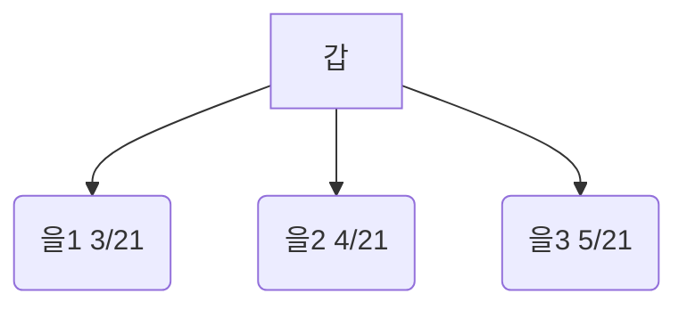

```table-of-contents
```
---
# 설계의 이해 (==HOW, 변경 시 추적== 버전 관리)

## 요구 분석과 설계의 차이
![[5장 설계 시 주의사항-1776887528766.webp]]

- ==Original Source==이자 ==요구 분석==은 What이다


---

# 설계의 원리


## 분할과 정복 == ==모듈화==

> Divide & Conquer

1. 분할
	1. 시스템을 더 작은 단위로 나누는 과정
2. 정복
	1. 나눈 요소를 하나 씩 개발
		1. 최종 - 전체 시스템 완성하는 과정


### 특징
![[5장 설계 시 주의사항-1776888396628.webp]]

### 예시
- ==점증적 통합== / 모듈화


- 빅뱅 통합


## 추상화
> 추상화
> 	복잡한 정보
> 		==단순화==
> 		==필요한 특징==만 드러냄
> 		==불필요한 세부 사항은 숨기는==
> 	과정

### 일반화와 구체화
- 일반화
	- 개념이 커짐
	- Generalization
- 구체화
	- 좁아짐
	- Specialization

### 객체 지향에서 추상화
- 객체 명
	- 클래스 명
- 변수
	- 상태
- 함수
	- method


## 캡슐화 - Encapsulation
- 서로 관련된 정보와 처리 방식을 묶고, 외부에 감추어 두는 것
	- 가시성
- 정보
	- data, value
- 처리 방식
	- method
- 묶음
	- Class

### 장점
1. 데이터 보호
2. 제공자 / 이용자 분리
3. 이용자 - 편리성 제공
	1. method의 기능만 알면 됨
4. 변화에 영향이 국지적
	1. 내부 데이터 구조 변경
	2. 하지만, 다른 객체에는 영향을 주지 않음
5. 객체 간 정보 독립성 보장
	1. 캡슐화
6. 변경 용이성 / 재사용성 증대


## 정보 은닉 / 상태, 변수 / - + `#`

![[5장 설계 시 주의사항-1776889545038.webp]]

1. +
	1. public
2. -
	1. private
	2. 해당 클래스 method only
3. #
	1. Protected
		1. 상속받은 하위 클래스만 접근

## 다형성 / Polymorphism
1. ==중복 정의==
	1. Overloading
	2. 같은 이름의 기능을 여러 방식으로 정의하는 것
		1. 넘어가서 호출
2. ==재정의 - redefinition==
	1. Overriding
	2. 상위 클래스에서 정의한 기능을 하위 클래스에서 다시 정의하는 것
	3. 리스코프 교체 / 대체 원칙
		1. ==Liskov Substitution Principle==

### ==리스코프 교체 원칙==
![[5장 설계 시 주의사항-1776891269364.webp|328x129]]

- 상위 클래스의 객체 - 하위 클래스의 객체로 교체
	- 프로그램의 실행 결과는 같아야 함
- 하위 클래스 - 상위 클래스의 동작을 유지 / 확장
	- 기존의 기능을 변경하거나, 훼손해서는 안 됨


# 모듈화
1. 응집도
	1. 높음
2. 결합도 - coupling
	1. 낮음


## 응집도 - Cohesion

==우==리가 ==논 시절== ==교순==님이 응집도가 높은 ==기==계를 만들었다
![[5장 설계 시 주의사항-1776891634567.webp]]


## 결합도 - Coupling

==데이터== ==스==파게티 ==제어== 실습실 ==공통 결합==된 ==내용==이 털림
![[5장 설계 시 주의사항-1776891796221.webp]]


---
# 사용자 인터페이스 설계

## User-Interface 이해
- Not on-Board
- 객체 - 객체 사이를 연결해주는 매개체
- 주체에 따른 분류 
	- HW
	- SW
		- API - Applicatino Programing Interface
		- UI - User Interface
		- Ex)
			- 사용자 HW Input -> scanf("%d", &a); -> variable 에 저장
				- 이때, scnaf는 ==사용자 HW Intrupt 와 변수를 연결하는 Interface==인 것
	- 사용자 - 사용자

## User-Interface 설계 지침
1. ==사용법을 배우기 쉬워야== 한다
2. 사용하기 ==편리==해야 한다
3. 사용자가 ==데이터 입력을 제어==할 수 있어야 한다
4. 사용자의 ==입력에 반응==해야 한다
5. ==도움말==을 제공해야 한다
6. ==일관성==을 유지해야 한다
7. ==입력 작업은 최소==로 해야 한다
8. ==효율성을 고려==해야 한다
9. 사용자 오류에 대한==되돌리기 기능==을 제공해야 한다
10. ==삭제 / 취소 버튼 클릭 시 재확인==을 요구해야 한다
11. 사용하기 쉽게 ==직관적==이어야 한다


